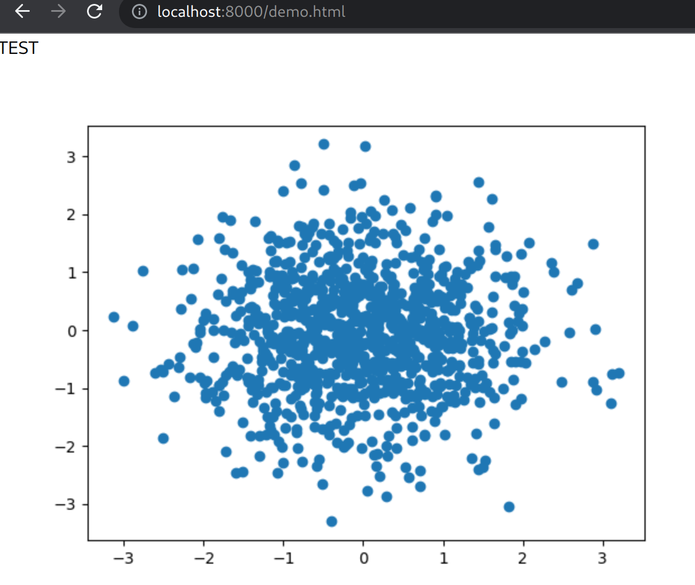

# PyScript

Pyscript is Python in WebAssembly.

Homepage: https://pyscript.net/

This project contains an HTML file and a Python file. That's it.

Start a web server (f.ex. python) with:

```sh
python -m http.server 8000
```

And visit it at: http://localhost:8000/demo.html

It should look similar to this:

